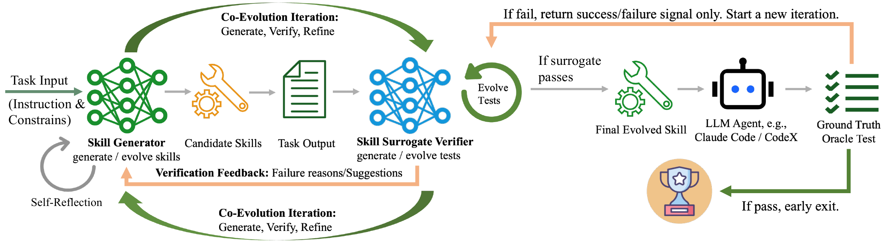
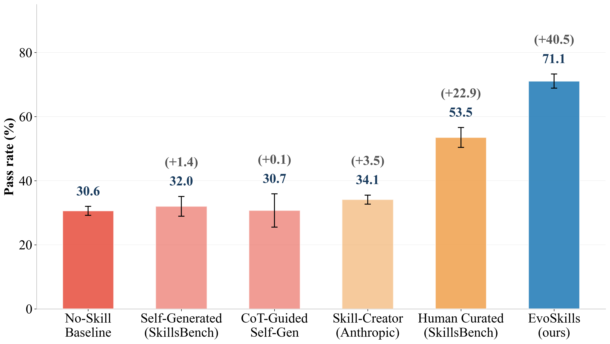
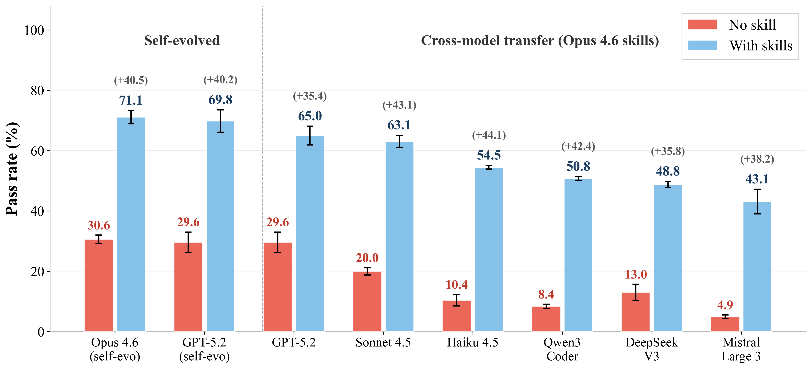
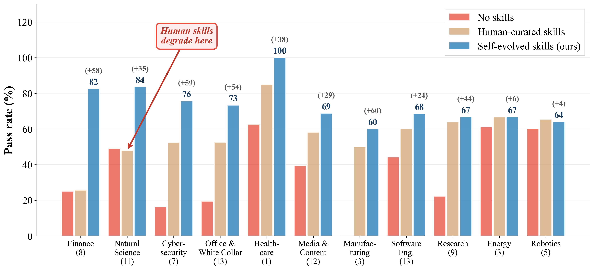
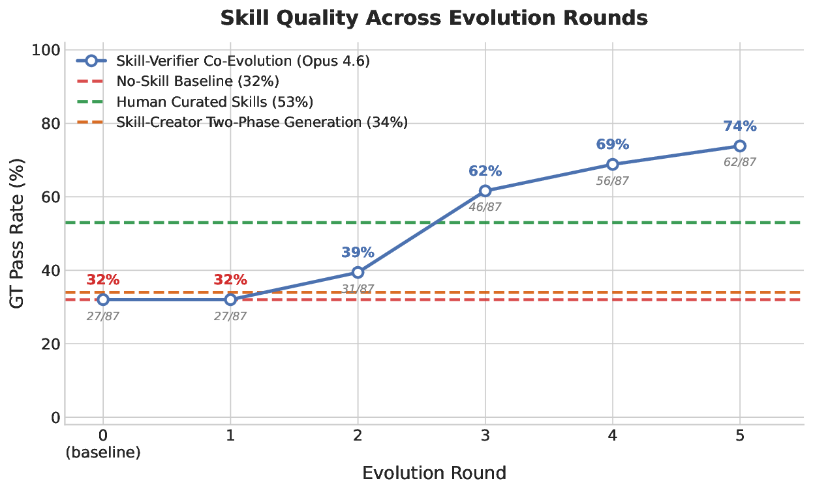

<div align="center">

# 🧬 CoEvoSkills

### Self-Evolving Agent Skills via Co-Evolutionary Verification

[](https://arxiv.org/pdf/2604.01687)
[](https://arxiv.org/abs/2604.01687)
[](https://zhang-henry.github.io/CoEvoSkills/)
[](https://github.com/benchflow-ai/skillsbench)

<em>A self-evolving framework that lets LLM agents construct reusable,<br>
multi-file Skill packages without access to protected ground-truth answers.</em>

If you find CoEvoSkills useful, please consider [citing our work](#citation).

</div>

---

## Citation

If you find this work useful, please consider citing:

```bibtex
@misc{zhang2026coevoskillsselfevolvingagentskills,
      title={CoEvoSkills: Self-Evolving Agent Skills via Co-Evolutionary Verification},
      author={Hanrong Zhang and Shicheng Fan and Henry Peng Zou and Yankai Chen and Zhenting Wang and Jiayu Zhou and Chengze Li and Wei-Chieh Huang and Yifei Yao and Kening Zheng and Xue Liu and Xiaoxiao Li and Philip S. Yu},
      year={2026},
      eprint={2604.01687},
      archivePrefix={arXiv},
      primaryClass={cs.AI},
      url={https://arxiv.org/abs/2604.01687},
}
```

## Overview

Agent Skills are structured folders of instructions, scripts, and resources
that help an Agent perform specialized workflows. CoEvoSkills learns these
packages through a repeated **generate → verify → refine** loop.

<div align="center">
  
  <br/>
  <sub><b>Figure 1.</b> A tool exposes one operation; a Skill packages a reusable workflow and its supporting resources.</sub>
</div>

CoEvoSkills couples two evolving components:

- **Skill Generator** — creates and revises a schema-valid, multi-file Skill.
- **Surrogate Verifier** — independently builds executable checks and returns
  dense diagnostic feedback without seeing protected benchmark answers.

A fresh ground-truth Agent periodically tests the current Skill. It receives
the task and Skill only—never the background document or the evolution
conversation. A canonical reward of `1.0` ends evolution; otherwise the opaque
failure feedback starts the next revision.

<div align="center">
  
  <br/>
  <sub><b>Figure 2.</b> Co-evolution of the Skill Generator and Surrogate Verifier, with isolated ground-truth testing.</sub>
</div>

## Highlights

- **Structured Skills:** evolves executable, multi-file Agent Skill packages
  rather than a single prompt or function.
- **Information isolation:** background documents contain domain knowledge,
  while protected answers and verifier internals remain unavailable during
  evolution.
- **Independent transfer test:** every finalized Skill is evaluated by a fresh
  Agent in Skill-only mode.
- **Cross-model support:** the framework supports Claude, OpenAI/Codex, Gemini,
  Vertex AI, Amazon Bedrock, Azure OpenAI, and LiteLLM-compatible routes.

## Repository contents

Everything needed for the 85-task release is included in this repository. The
three generated-data locations have deliberately different lifecycles:
`artifacts/` is the immutable release bundle, `workspaces/` contains mutable
run-specific task copies, and `outputs/` contains run-specific evidence.

| Path | What it contains |
|---|---|
| `tasks/` | The exact 85 benchmark task packages used by this release: instructions, runtime inputs, Docker environments, and canonical verifiers. |
| `artifacts/background_docs/` | One answer-free domain reference set per task in the bundled release. These documents are available during evolution only. |
| `artifacts/skills/` | The immutable, schema-valid Skill package bundled for each task. Do not use this directory as an evolution workspace. |
| `artifacts/skill_status.tsv` | Whether each bundled Skill obtained canonical reward `1.0` in a fresh Skill-only run or remains a candidate. |
| `artifacts/evaluations/` | Trace-free summaries from published Skill-only transfer evaluations. |
| `libs/terminus_agent/` | Skill Generator, Surrogate Verifier, and fresh Skill-only Agent implementations. |
| `meta_skills/skill-creator/` | The Skill package format and authoring rules supplied to the evolution Agent. |
| `scripts/prepare_tasks.py` | Creates an isolated evolution or Skill-only copy of selected tasks. The bundled originals are not modified. |
| `scripts/run_condition.sh` | Runs a prepared condition and writes all generated output under one run directory. |
| `run_exp.py` | Docker/Harbor task scheduler and result collector. |
| `workspaces/<RUN_ID>/` | Mutable, isolated task copies. Evolution writes new Skills and verifier state here. Generated locally and ignored by Git. |
| `outputs/<RUN_ID>/` | Immutable snapshots, task sandboxes, logs, and summaries from one run. Generated locally and ignored by Git. |

The task packages are adapted from SkillsBench commit
`a7028dfd37cfff86acaf248656cdbd9ad0179592`. CoEvoSkills-specific changes are
already present in `tasks/`; their attribution is recorded in `NOTICE`.

The two large archives under `tasks/sec-financial-report/environment/` are the
SEC Form 13F bulk datasets used by that benchmark task. They contain the Q2 and
Q3 2025 filing tables, including `COVERPAGE.tsv`, `INFOTABLE.tsv`, and the
submission and summary tables. They are task inputs—not generated logs or model
outputs.

## Quick start

### 1. Install

Requirements:

- Linux or macOS
- Python 3.12
- Docker
- [`uv`](https://docs.astral.sh/uv/)
- Credentials for the model provider you want to use

```bash
git clone https://github.com/Zhang-Henry/CoEvoSkills.git
cd CoEvoSkills

uv sync --locked
cp .env.example .env
docker info
```

Fill in one Agent-provider block in `.env`. Login commands and environment variables
for Claude Code subscription, Anthropic API, Vertex AI, Amazon Bedrock, Gemini,
OpenAI/Codex, and Azure OpenAI are documented in
[`docs/provider_setup.md`](docs/provider_setup.md).

Some benchmark tasks also declare task-specific API variables independently of
the Agent provider. Before a full 85-task run, follow the task-credential check
in the provider setup guide. In particular, `pg-essay-to-audiobook` needs
`OPENAI_API_KEY` for its canonical verifier even when the Agent uses Claude.

### 2. Run one released Skill

The following stages one finalized Skill with its background document removed,
then gives the task and Skill to a fresh Claude Code Agent:

```bash
export RUN_ID=skill-only-smoke

uv run python scripts/prepare_tasks.py \
  --condition skill-only \
  --skill-set validated \
  --tasks 3d-scan-calc

MODEL=anthropic/claude-opus-4-6 \
AGENT=claude-code-skill-only \
MAX_PARALLEL=1 \
  scripts/run_condition.sh skill-only --only-tasks 3d-scan-calc
```

Set `--skill-set all` to stage all released Skills, including candidates. Use
`--skill-set validated` for the finalized subset reported by the release. This
status check also applies when `--tasks` names an explicit subset, so a candidate
cannot be staged accidentally as a validated Skill.

The preparation command physically removes the background-document directory.
The fresh Agent receives only the task and the released Skill. Choose the Agent
adapter and model route below:

| Agent route | `AGENT` | Example `MODEL` |
|---|---|---|
| Claude Code (subscription, Anthropic API, Vertex AI, or Bedrock) | `claude-code-skill-only` | `anthropic/claude-opus-4-6` |
| Codex with ChatGPT subscription | `codex-subscription` | `openai/gpt-5.4` |
| Codex with OpenAI API | `codex-skill-only` | `openai/<available-codex-model>` |
| Other LiteLLM-backed Agents (exploratory transfer) | `terminus-2` | `<provider>/<model-id>` |

Strict release reproduction uses `claude-code-skill-only`,
`codex-skill-only`, or `codex-subscription`. These adapters enforce the
no-Doc barrier, make the released Skill read-only, and attest its digest before
and after the run. The generic `terminus-2` route is useful for exploratory
cross-model transfer, but it is not treated as equivalent strict attestation.

For example, to stage the same released Skill in an isolated Codex subscription
run:

```bash
codex login
codex login status

export CODEX_CHATGPT_AUTH_FILE="$HOME/.codex/auth.json"
export CODEX_CLI_BINARY="$(command -v codex)"
export CODEX_REASONING_EFFORT="low"
export RUN_ID=codex-skill-only-smoke

uv run python scripts/prepare_tasks.py \
  --condition skill-only \
  --skill-set validated \
  --tasks 3d-scan-calc

MODEL=openai/gpt-5.4 \
AGENT=codex-subscription \
MAX_PARALLEL=1 \
  scripts/run_condition.sh skill-only --only-tasks 3d-scan-calc
```

For an OpenAI API-backed Codex run, export `OPENAI_API_KEY`, replace `AGENT`
with `codex-skill-only`, and set `MODEL` to a Codex model available to that API
project. For Gemini, Azure OpenAI, or another LiteLLM-supported model, export
that provider's credentials and run with `AGENT=terminus-2` and its
provider-qualified model name. Exact authentication examples are in
[`docs/provider_setup.md`](docs/provider_setup.md).

When adding a new native Agent adapter, preserve the evaluation contract: load
the released package from `/app/environment/skills/*/SKILL.md`, expose no
background document, keep the Skill immutable during the run, and execute the
canonical task verifier after the Agent exits.

### 3. Evolve a Skill from zero

Evolution starts with the task's background document and an empty Skill
directory. Each ground-truth intervention launches a fresh Skill-only Agent.

```bash
export RUN_ID=evolution-canary

uv run python scripts/prepare_tasks.py \
  --condition evolution \
  --tasks 3d-scan-calc

MODEL=anthropic/claude-opus-4-6 \
AGENT=terminus-2-evolution \
VERIFIER_MODEL=anthropic/claude-opus-4-6 \
GT_ORACLE_MODEL=anthropic/claude-opus-4-6 \
GT_ORACLE_AGENT=claude-code-skill-only \
MAX_GT_ITERATIONS=5 \
MAX_PARALLEL=1 \
  scripts/run_condition.sh evolution --only-tasks 3d-scan-calc
```

Start with one task. For the full benchmark, choose a new `RUN_ID`, rerun the
preparation command without `--tasks`, then run without `--only-tasks` and
increase `MAX_PARALLEL`. Reusing an existing `RUN_ID` requires `--force` on the
preparation command and intentionally replaces that mutable workspace.

To continue an interrupted evolution without mixing its old and new evidence,
choose a new output `RUN_ID`, point `TASKS_DIR` to the existing workspace, and
set `EVOLUTION_MODE=continue`:

```bash
export RUN_ID=evolution-canary-continuation
export TASKS_DIR="$PWD/workspaces/evolution-canary/evolution"
export EVOLUTION_MODE=continue

MODEL=anthropic/claude-opus-4-6 \
AGENT=terminus-2-evolution \
VERIFIER_MODEL=anthropic/claude-opus-4-6 \
GT_ORACLE_MODEL=anthropic/claude-opus-4-6 \
GT_ORACLE_AGENT=claude-code-skill-only \
  scripts/run_condition.sh evolution --only-tasks 3d-scan-calc
```

### 4. Reproduce the 64 finalized Skill-only evaluations

`--skill-set validated` resolves to the 64
`validated_skill_only_full_score` rows in `artifacts/skill_status.tsv`.

```bash
export RUN_ID=skill-only-reproduction

uv run python scripts/prepare_tasks.py \
  --condition skill-only \
  --skill-set validated

MODEL=anthropic/claude-opus-4-6 \
AGENT=claude-code-skill-only \
MAX_PARALLEL=10 \
  scripts/run_condition.sh skill-only
```

Each run is isolated under `outputs/<RUN_ID>/`:

```text
outputs/<RUN_ID>/
  run.log      Combined dispatcher output
  jobs/        Per-task Agent and Docker artifacts
  results/     CSV summaries
```

Create a trace-free aggregate for the run with:

```bash
uv run python scripts/summarize_skill_only_results.py \
  --results-root "outputs/$RUN_ID/results" \
  --jobs-root "outputs/$RUN_ID/jobs" \
  --status-file artifacts/skill_status.tsv \
  --output-tsv "outputs/$RUN_ID/summary.tsv" \
  --output-summary "outputs/$RUN_ID/summary.json" \
  --model anthropic/claude-opus-4-6 \
  --agent claude-code-skill-only
```

### 5. Run tasks in batches

To evaluate all 85 bundled Skills, including the candidate packages, prepare
the complete Skill set and omit `--only-tasks` from the runner:

```bash
export RUN_ID=skill-only-all-85

uv run python scripts/prepare_tasks.py \
  --condition skill-only \
  --skill-set all

MODEL=anthropic/claude-opus-4-6 \
AGENT=claude-code-skill-only \
MAX_PARALLEL=10 \
  scripts/run_condition.sh skill-only
```

To evolve Skills from empty Skill directories for all 85 tasks, prepare the
evolution condition without `--tasks` and run it without `--only-tasks`:

```bash
export RUN_ID=evolution-all-85

uv run python scripts/prepare_tasks.py \
  --condition evolution

MODEL=anthropic/claude-opus-4-6 \
AGENT=terminus-2-evolution \
VERIFIER_MODEL=anthropic/claude-opus-4-6 \
GT_ORACLE_MODEL=anthropic/claude-opus-4-6 \
GT_ORACLE_AGENT=claude-code-skill-only \
MAX_GT_ITERATIONS=5 \
MAX_PARALLEL=4 \
  scripts/run_condition.sh evolution
```

For a smaller batch, pass the same comma-separated task list to both steps:

```bash
export RUN_ID=selected-tasks-r1
export TASK_LIST=3d-scan-calc,protein-expression-analysis,dialogue-parser

uv run python scripts/prepare_tasks.py \
  --condition skill-only \
  --skill-set all \
  --tasks "$TASK_LIST"

MODEL=anthropic/claude-opus-4-6 \
AGENT=claude-code-skill-only \
MAX_PARALLEL=3 \
  scripts/run_condition.sh skill-only --only-tasks "$TASK_LIST"
```

Before a benchmark-wide run, configure the selected provider and every
task-specific credential described in
[`docs/provider_setup.md`](docs/provider_setup.md). Start with a small canary,
then raise `MAX_PARALLEL` to fit the host's CPU, memory, Docker capacity, and
provider quota.

Evolution also leaves a mutable working copy at
`workspaces/<RUN_ID>/evolution/<task>/environment/skills/evo-*/SKILL.md`. The
run-specific snapshot under `outputs/<RUN_ID>/results/.../skills/` is the safer
artifact to archive or compare because a later continuation may change the
workspace copy.

Use a new `RUN_ID` and rerun `prepare_tasks.py` for every independent replicate.
Raw model output stays local and is not part of the release. The runner also
locks mutable evolution workspaces, so two processes cannot silently evolve
the same task copy at once.

## Extend the framework

### Add a task before it has a Skill

A new evolution task needs a SkillsBench-compatible task package and an
answer-free background document; it does **not** need a placeholder Skill or a
row in `skill_status.tsv`:

```text
my_tasks/new-task/task.toml
my_tasks/new-task/environment/
my_release/background_docs/new-task/domain-reference.md
```

```bash
export RUN_ID=new-task-evolution-r1

uv run python scripts/prepare_tasks.py \
  --condition evolution \
  --base my_tasks \
  --release-root my_release \
  --tasks new-task

MODEL=<provider>/<model-id> \
AGENT=terminus-2-evolution \
VERIFIER_MODEL=<provider>/<model-id> \
GT_ORACLE_MODEL=<provider>/<model-id> \
GT_ORACLE_AGENT=<skill-only-agent> \
MAX_GT_ITERATIONS=5 \
MAX_PARALLEL=1 \
  scripts/run_condition.sh evolution --only-tasks new-task
```

To evaluate a fixed Skill, add `skills/new-task/<skill-name>/SKILL.md` and a
`skill_status.tsv` row under the selected release root, then prepare the
`skill-only` condition. A future version can live under `releases/v2/` and be
selected with `--release-root releases/v2`; no framework code needs to change.

### Add an Agent adapter

API-backed models supported by LiteLLM only require a new model string. A new
native Harbor Agent can be registered at runtime instead of editing the built-in
registry:

```bash
export RUN_ID=custom-agent-smoke

uv run python scripts/prepare_tasks.py \
  --condition skill-only \
  --skill-set validated \
  --tasks 3d-scan-calc

MODEL=<provider>/<model-id> \
AGENT=my-agent \
  scripts/run_condition.sh skill-only \
  --only-tasks 3d-scan-calc \
  --agent-import-path my-agent=my_package.agents:MyAgent
```

The same registration can be used as `GT_ORACLE_AGENT=my-agent` during
evolution. The class must accept Harbor's `logs_dir` and `model_name`
constructor arguments and be importable in the runner environment.

## Main results

<div align="center">
  
  <br/>
  <sub><b>Figure 3.</b> Main SkillsBench comparison reported in the paper.</sub>
</div>

### Cross-model transfer

<div align="center">
  
  <br/>
  <sub><b>Figure 4.</b> Skills transfer to additional Agent backbones without retraining.</sub>
</div>

### Per-domain performance

<div align="center">
  
  <br/>
  <sub><b>Figure 5.</b> Pass rate across the 11 SkillsBench domains.</sub>
</div>

### Evolution trajectory

<div align="center">
  
  <br/>
  <sub><b>Figure 6.</b> Performance over successive co-evolution iterations.</sub>
</div>
